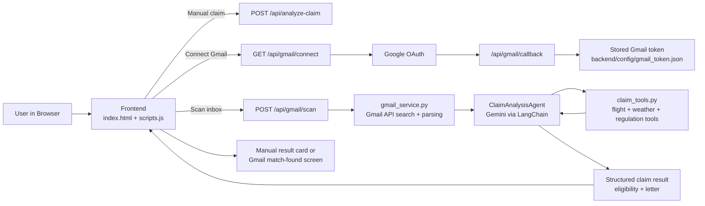

# Bureaucracy Hacker

Flight compensation checker for EU261 claims with:
- a FastAPI backend
- a static frontend
- Gemini-powered claim analysis
- direct Gmail OAuth and inbox scanning

## Architecture



## Run locally

### Backend
```bash
cd backend
../.venv/bin/pip install -r requirements.txt
../.venv/bin/uvicorn main:app --host 127.0.0.1 --port 8001
```

### Frontend
```bash
python3 -m http.server 8000
```

Open:
- Frontend: `http://localhost:8000`
- Backend activity view: `http://127.0.0.1:8001`

## Required environment

Create `backend/.env` from `backend/.env.example`.

Minimum manual-claim setup:
```env
GOOGLE_API_KEY=your_gemini_api_key
BACKEND_PORT=8001
BACKEND_HOST=127.0.0.1
FRONTEND_URL=http://localhost:8000
```

Additional Gmail setup:
```env
GOOGLE_OAUTH_CLIENT_ID=your_google_oauth_client_id
GOOGLE_OAUTH_CLIENT_SECRET=your_google_oauth_client_secret
GOOGLE_OAUTH_REDIRECT_URI=http://127.0.0.1:8001/api/gmail/callback
```

## Main routes

- `POST /api/analyze-claim` analyzes a manually entered flight disruption
- `GET /api/gmail/status` returns Gmail connection status
- `GET /api/gmail/connect` starts Google OAuth
- `POST /api/gmail/scan` scans inbox messages and analyzes the best match
- `POST /api/gmail/disconnect` removes stored Gmail credentials
- `GET /api/regulations/{jurisdiction}` returns simple regulation info

## Project structure

- [index.html](/Users/krishnaprasadchapagain/Desktop/IDS517_project/Flight_Agent_V2/index.html)
- [scripts.js](/Users/krishnaprasadchapagain/Desktop/IDS517_project/Flight_Agent_V2/scripts.js)
- [style.css](/Users/krishnaprasadchapagain/Desktop/IDS517_project/Flight_Agent_V2/style.css)
- [backend/main.py](/Users/krishnaprasadchapagain/Desktop/IDS517_project/Flight_Agent_V2/backend/main.py)
- [backend/gmail_service.py](/Users/krishnaprasadchapagain/Desktop/IDS517_project/Flight_Agent_V2/backend/gmail_service.py)
- [backend/agents/claim_agent.py](/Users/krishnaprasadchapagain/Desktop/IDS517_project/Flight_Agent_V2/backend/agents/claim_agent.py)
- [backend/tools/claim_tools.py](/Users/krishnaprasadchapagain/Desktop/IDS517_project/Flight_Agent_V2/backend/tools/claim_tools.py)

## Notes

- The claim tools still use mocked flight/weather/regulation data in places.
- Gmail scanning prefers structured airline-style emails with explicit labels such as `Flight Number`, `Departure Airport`, and `Total Delay`.
- OAuth and Gmail token files are intentionally local-only and ignored by git.
