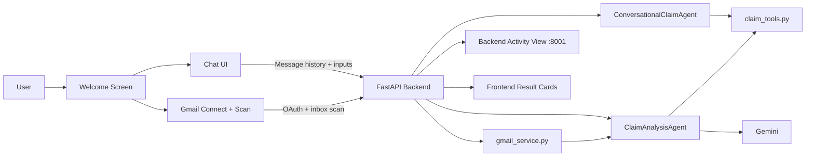
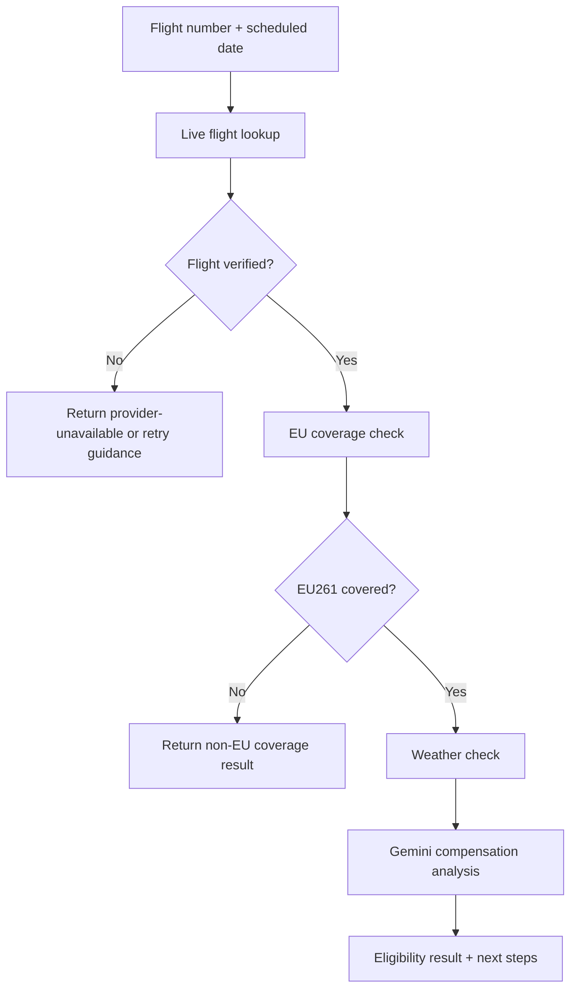
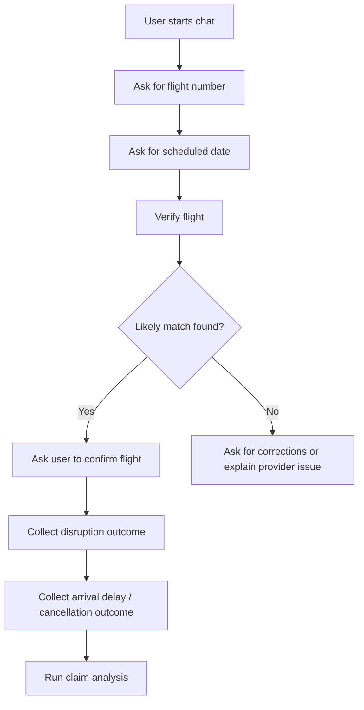
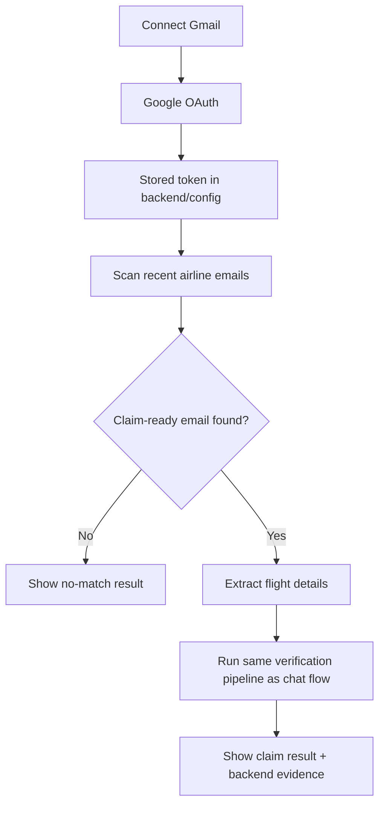

# FlightClaim AI

FlightClaim AI is a flight disruption intake and compensation analysis app focused on EU261-style claim checking.

It includes:
- a static frontend with a welcome screen, guided chat, and Gmail scan flow
- a FastAPI backend with chat, Gmail OAuth, claim analysis, and an activity dashboard
- Gemini-powered reasoning for compensation analysis
- provider-backed flight verification with graceful fallback and workflow visibility

## Product overview

The app is designed to do the following:
- collect a flight number and scheduled date
- verify the flight with a live provider when configured
- decide whether the trip is EU-covered
- check weather evidence for EU-covered cases
- send the verified context to Gemini for a claim decision
- show the workflow in both the user UI and the backend activity page

## Current user experience

### Frontend flow

1. The user lands on a welcome screen.
2. The user clicks `Start claim check`.
3. The chat asks for the flight number and scheduled date first.
4. The app gathers disruption details such as:
   - delay
   - cancellation
   - denied boarding
   - missed connection
5. If a live provider match is found, the app can ask the user to confirm the flight.
6. The app returns a claim result or a clear explanation of what is still missing.

### Gmail flow

1. The user connects Gmail with Google OAuth.
2. The app scans recent airline emails.
3. The app extracts candidate flight details from the inbox.
4. The extracted flight enters the same verification pipeline as manual chat input.
5. The backend activity page shows Gmail extraction steps as well as the later claim-analysis steps.

## Main architecture



## Verification pipeline



## Manual chat flow



## Gmail scan flow



## Backend activity dashboard

The backend dashboard is available at `http://127.0.0.1:8001`.

It is meant to show the latest workflow state, including:
- claim input
- flight verification
- Gmail extraction
- weather verification
- EU coverage
- decision summary
- workflow steps
- raw evidence JSON
- rolling logs

This page is updated by:
- manual claim analysis
- chat workflow snapshots
- Gmail scan workflow snapshots

## Run locally

### Backend

```bash
cd backend
../.venv/bin/pip install -r requirements.txt
../.venv/bin/python -m uvicorn main:app --host 127.0.0.1 --port 8001
```

### Frontend

```bash
python3 -m http.server 8000
```

Open:
- Frontend: `http://127.0.0.1:8000`
- Backend activity view: `http://127.0.0.1:8001`

## Environment setup

Create `backend/.env` from `backend/.env.example`.

### Minimum setup

```env
GOOGLE_API_KEY=your_gemini_api_key
GEMINI_MODEL=gemini-2.5-pro
BACKEND_PORT=8001
BACKEND_HOST=localhost
FRONTEND_URL=http://localhost:8000
```

### Live flight verification

Preferred provider support currently includes:

```env
AERODATABOX_APIMARKET_KEY=your_apimarket_key
# or
AERODATABOX_RAPIDAPI_KEY=your_rapidapi_key
AERODATABOX_RAPIDAPI_HOST=aerodatabox.p.rapidapi.com
```

Fallback support:

```env
AVIATIONSTACK_API_KEY=your_aviationstack_api_key
```

### Gmail OAuth

```env
GOOGLE_OAUTH_CLIENT_ID=your_google_oauth_client_id
GOOGLE_OAUTH_CLIENT_SECRET=your_google_oauth_client_secret
GOOGLE_OAUTH_REDIRECT_URI=http://localhost:8001/api/gmail/callback
```

## Important provider note

Live verification depends on a working external flight-data subscription.

If the configured provider is unavailable, the app now:
- keeps the extracted or user-provided flight context
- shows a provider-unavailable message instead of pretending the user is ineligible
- records the failed step on the backend activity page

This is especially important for Gmail scans, because Gmail extraction can succeed even when live flight verification fails afterward.

## Main API routes

- `POST /api/chat`
  - conversational claim intake
  - supports step-by-step collection and flight confirmation flow
- `POST /api/analyze-claim`
  - direct claim analysis for structured/manual requests
- `GET /api/gmail/status`
  - Gmail connection state
- `GET /api/gmail/connect`
  - starts Google OAuth
- `GET /api/gmail/callback`
  - handles OAuth callback
- `POST /api/gmail/scan`
  - scans recent airline emails and feeds extracted details into the claim pipeline
- `POST /api/gmail/disconnect`
  - removes stored Gmail credentials
- `GET /api/latest-analysis`
  - exposes the latest workflow snapshot for the backend dashboard
- `GET /api/logs`
  - exposes rolling logs for the backend dashboard

## Project structure

- [index.html](/Users/krishnaprasadchapagain/Desktop/IDS517_project/Flight_Agent_V2/index.html)
- [scripts.js](/Users/krishnaprasadchapagain/Desktop/IDS517_project/Flight_Agent_V2/scripts.js)
- [style.css](/Users/krishnaprasadchapagain/Desktop/IDS517_project/Flight_Agent_V2/style.css)
- [backend/main.py](/Users/krishnaprasadchapagain/Desktop/IDS517_project/Flight_Agent_V2/backend/main.py)
- [backend/gmail_service.py](/Users/krishnaprasadchapagain/Desktop/IDS517_project/Flight_Agent_V2/backend/gmail_service.py)
- [backend/agents/chat_agent.py](/Users/krishnaprasadchapagain/Desktop/IDS517_project/Flight_Agent_V2/backend/agents/chat_agent.py)
- [backend/agents/claim_agent.py](/Users/krishnaprasadchapagain/Desktop/IDS517_project/Flight_Agent_V2/backend/agents/claim_agent.py)
- [backend/tools/claim_tools.py](/Users/krishnaprasadchapagain/Desktop/IDS517_project/Flight_Agent_V2/backend/tools/claim_tools.py)
- [backend/models/schemas.py](/Users/krishnaprasadchapagain/Desktop/IDS517_project/Flight_Agent_V2/backend/models/schemas.py)

## Demo test cases

Use these as showcase scenarios for demos and manual testing.

| Case | Flight | Date | Disruption | Follow-up | Passenger details | Expected result |
|---|---|---|---|---|---|---|
| Winning 1 | `AF22` | `2025-07-09` | `Cancelled` | `No replacement flight` | `Krishna`, `58`, `male`, `k@fa.com` | `Eligible — €600` |
| Winning 2 | `BA117` | `2025-05-14` | `Delayed` | `4 hours` | `Krishna`, `58`, `male`, `k@fa.com` | `Eligible — €600` |
| Winning 3 | `IB625` | `2025-08-19` | `Denied boarding` | `N/A` | `Krishna`, `58`, `male`, `k@fa.com` | `Eligible — €600` |
| Rejected 1 | `WJA714` | `2025-04-27` | `Delayed` | `2 hours` | `Not required` | `Not eligible` |
| Rejected 2 | `AA106` | `2025-05-22` | `Delayed` | `4 hours` | `Not required` | `Not eligible` |

### Demo input order

| Case | Inputs to type in order |
|---|---|
| Winning 1 | `AF22` → `2025-07-09` → `Cancelled` → `No replacement flight` → `Krishna` → `58` → `male` → `k@fa.com` |
| Winning 2 | `BA117` → `2025-05-14` → `Delayed` → `4 hours` → `Krishna` → `58` → `male` → `k@fa.com` |
| Winning 3 | `IB625` → `2025-08-19` → `Denied boarding` → `Krishna` → `58` → `male` → `k@fa.com` |
| Rejected 1 | `WJA714` → `2025-04-27` → `Delayed` → `2 hours` |
| Rejected 2 | `AA106` → `2025-05-22` → `Delayed` → `4 hours` |

## Notes

- The frontend now uses a production-style welcome screen instead of dropping directly into chat.
- The chat flow asks for flight number and scheduled date before verification.
- Cancellation follow-ups now ask for the outcome of the cancellation, such as rebooking or no replacement flight.
- Gmail scanning supports account selection during Google OAuth.
- The backend activity page is intended as an observability screen, not an end-user interface.
- Some weather and regulation logic still uses simplified or mocked logic in places.
